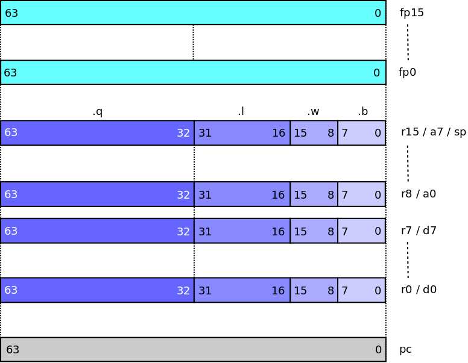

## [Documentation](../README.md) > [Programming](./README.md) > Model

The following page describes the programming model of the MC64K.

### Register Set

MC64K defines 16 64-bit General Purpose Registers for integer and address calculation, 16 64-bit IEEE-754 double precision Floating Point Registers for floating point calculation and a 64-bit read-only Program Counter. The register layout is depicted below.

### General Purpose Registers

The General Purpose Registers are used for integer and address calculation:

* Register names are r0 ... r15.
* Register names d0 ... d7 are accepted as aliases for r0 ... r7.
    - Names d0 ... d7 may not be used as base registers for indirect addressing modes.
* Register names a0 ... a7 are accepted as aliases for r8 ... r15.
* Register r15 / a7 is reserved for use as the stack pointer.

Most integer operations can be performed using .b (byte), .w (word), .l (long) and .q (quad) sizes. When applied to General Purpose Registers:

* Byte operations affect the least significant 8 bits (7:0).
* Word operations affect the least significant 16 bits (15:0).
* Long operations affect the least significant 32 bits (31:0).
* Quad operations affect all bits (63:0).

### Floating Point Registers

The Floating Point Registers are used for floating point calculation:

* Register names are fp0 ... fp15

Most floating point operations can be performed using .s (single) or .d (double) precision. However, the Floating Point Registers can only contain 64-bit values:

* Calculations on Floating Point Registers will always be carried out at 64-bit precision.
* 32-bit single precision indirect operands will be converted to 64-bit double precision when combined with a Floating Point Register for a calculation.
* 32-bit single precision calculation will only be used for operations where both operands are indirect 32-bit single precision values.

### Other Registers

The Program Counter (pc) is a 64-bit pointer that records the address of the current instruction being executed.

### Similarities to the 680x0 User Model

Where possible, MC64K adopts the naming and syntactical conventions of the 680x0 assembler programming model:

* Same mnemonics used for equivalent instructions, e.g. move, clr, add, sub, fadd
* Same _.size_ mnemonic suffix syntax:
    - _.b_, _.w_, _.l_ for integer operation sizes up to 32-bit.
    - _.s_, _.d_ for for floating point operation sizes up to 64-bit.
    - Introduces _.q_ for 64-bit integer operations.
* Register aliases for 680x0 register names:
    - Native register names are r0 ... r15
    - d0 ... d7 alias r0 ... r7
    - a0 ... a7 alias r8 ... r15
    - a7 / r15 is used as the stack pointer.
    - sp aliases r15
* Same addressing mode syntax for common addressing modes, e.g:
    - a0, (a0), -(a0), (a0)+, 16(a0), 16(a0, d0.w), -32(a0, d0.l * 8), 32(pc), etc.
    - Introduces (a0)-, +(a0) and _.q_ qualification for indexes.

### Differences from the 680x0 User Model

The following differences from the 680x0 assembler programming model are of note:

* Fully _dyadic_ logic and arithmetic instruction set:
    - Many 680x0 / 6888x instructions are _monadic_ e.g. neg, not, swap, etc.
    - Equivalent instructions are all _dyadic_ in MC64K.
* Effective Address support for source and destination operands simultaneously:
    - Most _dyadic_ 680x0 instructions allow an Effective Address mode for either the source or destination operand only, the other must be a register or immediate.
    - Immediate and Program Counter indirect Effective Addressing modes are allowed for the source operand.
    - All other Effective Addressing modes can be used for source and destination operands.
* 64-bit architecture:
    - 64-bit addressing.
    - 64-bit integer operations.
* No Condition Code Register:
    - Conditional Branching is by directly comparing operands and branch, e.g:
        - `bgt.l r0, r1, label` branch taken if r0 > r1
        - `biz.q r0, label` branch taken if r0 == 0
    - No instructions that set or test or otherwise use condition codes, e.g:
        - tst, chg, cas, tas, etc.
        - addx, subx, roxl, roxr, etc.
* No Binary Coded Decimal arithmetic.
* Missing Effective Addressing modes:
    - No immediate addressing modes.
    - No memory-indirect addressing modes.
    - No Indexed PC Relative addressing modes.
* Other Instruction Differences
    - Integer division for 32/64-bit operand sizes only. Does not calculate remainder.
    - Modulo instruction provided for 32/64-bit operand sizes.
* Simplified Floating Point Unit:
    - No Mode Control.
    - No support for extended precision.
    - No support for integer or packed decimal operands.
    - Register can contain 32 or 64 bit representations, depending on the last operation performed.
    - Casting instructions for conversion between integer, single and double precision.
    - No special FP Conditions:
        - Same compare and branch model as integer model.
    - Reduced subset of 6888x instructions:
        - Arithmetic, square root,
        - Basic trigonometry, logarithm and exponent.

### Instruction Set

* The supported MC64K instruction set is documented [here](../bytecode/Instructions.md).
* The supported addressing modes are documented [here](../bytecode/EffectiveAddress.md).
